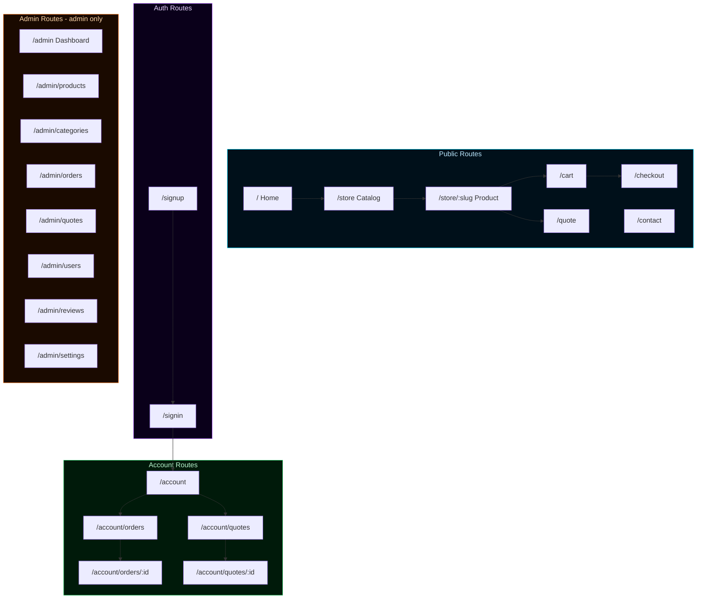
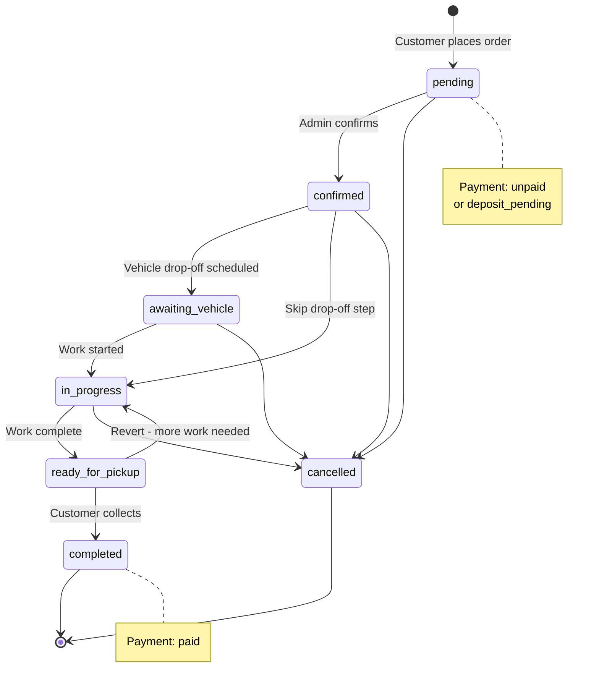
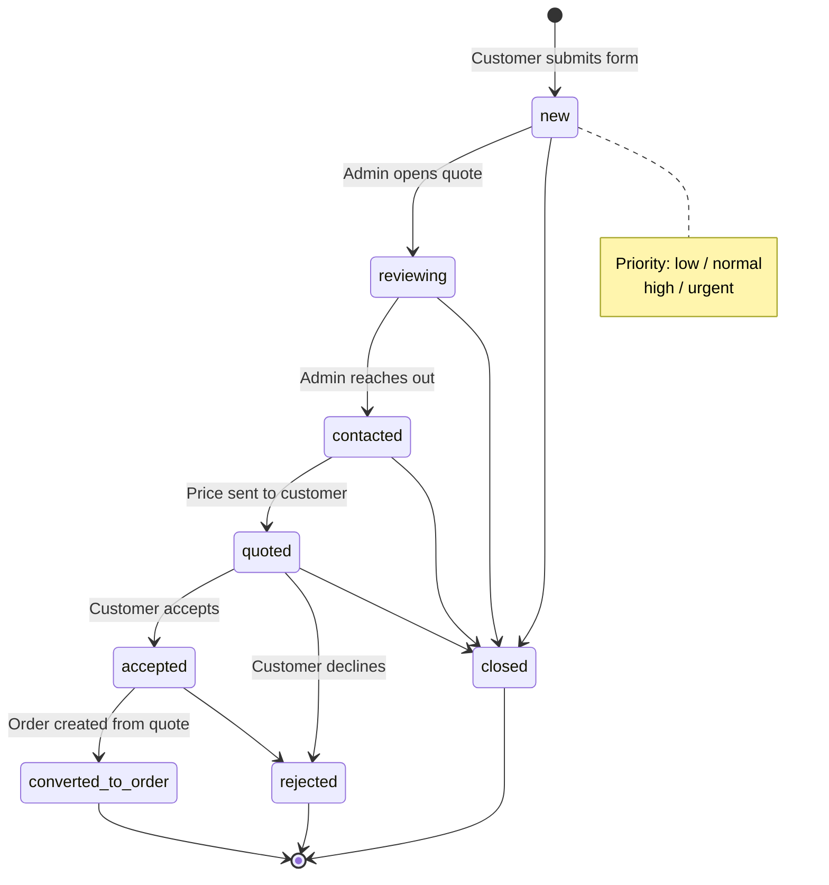
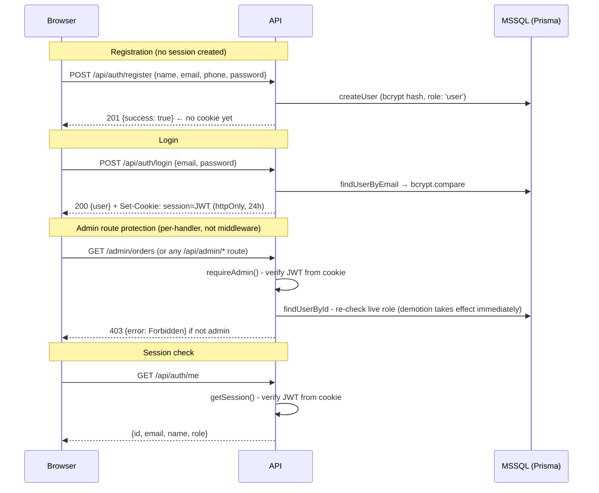
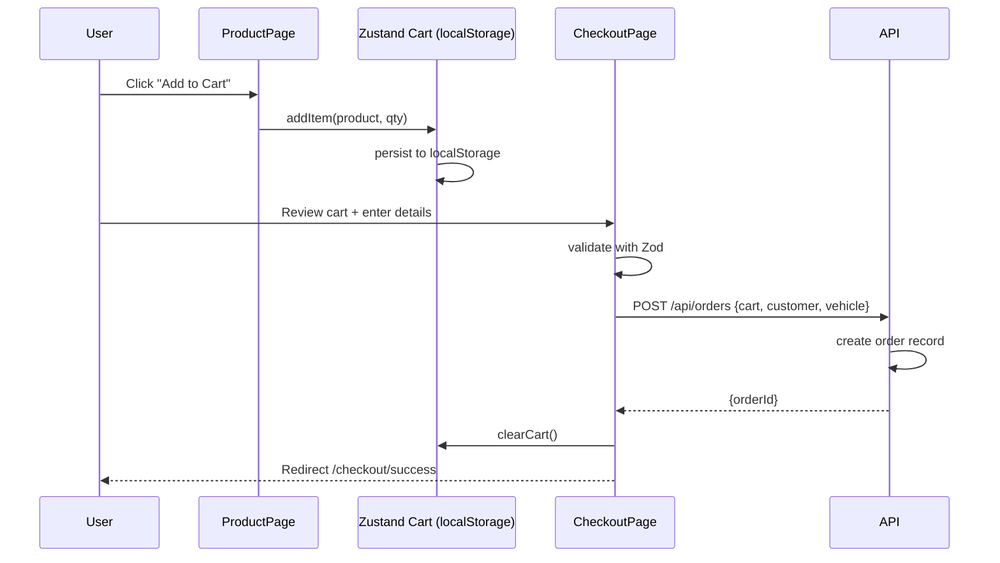
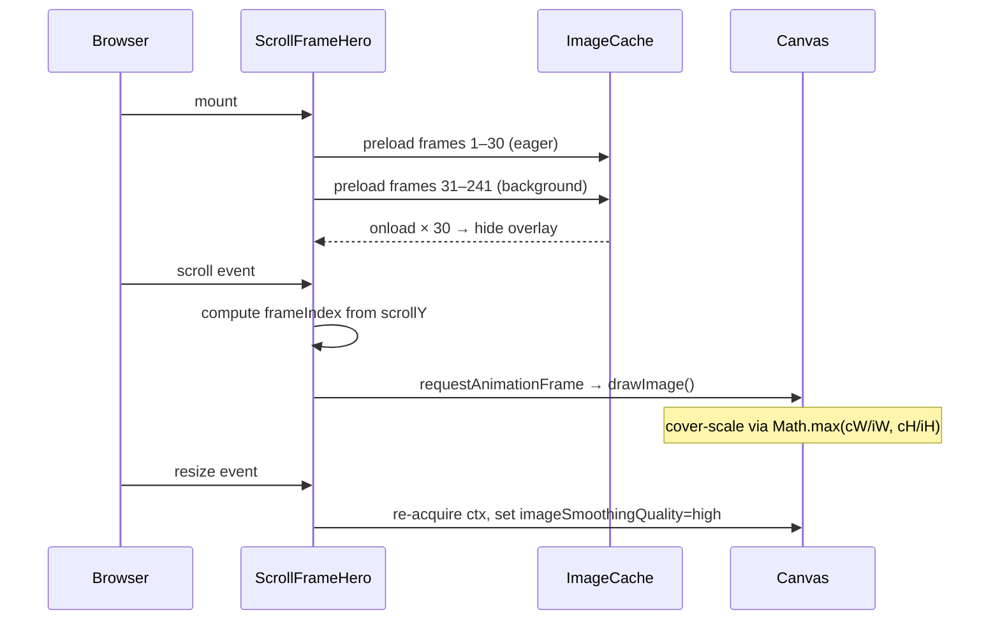

# JILBER Performance Engineering

> Full-stack automotive performance tuning e-commerce platform — product catalog, shopping cart, quote system, order lifecycle, admin dashboard, and WhatsApp integration.

Built with **Next.js 16 · React 19 · TypeScript 5 · Tailwind CSS v4**

---

## Tech Stack

| Layer | Technology | Version |
| --- | --- | --- |
| Framework | Next.js 16 (App Router, Turbopack) | 16.2.6 |
| UI Runtime | React | 19.2.4 |
| Language | TypeScript | 5 |
| Styling | Tailwind CSS v4 | 4.x |
| Auth | JWT via `jose` + `bcryptjs` | — |
| State | Zustand (cart, persisted) | 5.0.13 |
| Validation | Zod | 4.4.3 |
| Icons | lucide-react | latest |
| Database | Microsoft SQL Server | 2022 |
| ORM | Prisma | 6.x |

---

## Application Architecture



---

## Features

### Storefront

- Scroll-driven canvas hero — 241-frame JPEG sequence cover-scaled to any viewport
- Product catalog with category filtering and search
- Product detail pages with specs, compatibility, ratings, and reviews
- Shopping cart with Zustand (persisted to localStorage) and tax calculation
- Checkout flow with customer info, vehicle details, and payment method selection
- Order confirmation and success page

### Quote System

- Quote request form with product pre-fill (11 service categories)
- Quote status lifecycle: `new → reviewing → contacted → quoted → accepted → converted / rejected`
- Priority levels: low, normal, high, urgent
- Users can track quote progress from their account

### Order Lifecycle

- Full status pipeline: `pending → confirmed → awaiting vehicle → in progress → ready for pickup → completed / cancelled`
- Payment status tracking: unpaid, deposit pending/paid, paid, refunded, not required
- Status history audit trail per order

### Admin Dashboard

- Statistics: products, users, orders, revenue
- Product CRUD with drag-and-drop image upload
- Category management
- Order management with status updates and internal notes
- Quote request management with priority and status updates
- User management and role assignment (user / admin)
- Product review moderation (approve / reject)
- Shop settings: contact info, WhatsApp number, working hours, tax rate, currency

### Contact & Communication

- Floating WhatsApp and phone call buttons (site-wide)
- WhatsApp URL builder with pre-filled messages
- Dedicated contact page
- Product-level and cart-level contact CTAs

### SEO

- JSON-LD structured data (Organization, LocalBusiness)
- Dynamic XML sitemap generation
- Open Graph and Twitter card metadata
- Canonical URLs and robots.txt
- Centralized config at `lib/seo/site-config.ts`

### Auth

- Email + password registration and login
- JWT sessions stored in HTTP-only cookies (24-hour expiry)
- Role-based access control (user / admin)
- Admin-only middleware protection on all `/admin` routes

---

## Order Status Diagram



---

## Quote Lifecycle

> No hard transition enforcement — admin can set any status freely.
> The flow below shows the typical progression.



---

## Auth Flow



---

## Shopping Cart Flow



---

## Scroll Hero Pipeline



---

## Rendering Model

```mermaid
flowchart LR
    subgraph Server["Server Components (SSR / SSG)"]
        LAY[layout.tsx]
        HOME_S[Home sections]
        STORE_S[Store catalog]
        ADMIN_S[Admin pages]
        SEO[Metadata + JSON-LD]
    end

    subgraph Client["Client Components ('use client')"]
        NAV[Navbar]
        HERO[ScrollFrameHero]
        CART_C["Cart store - Zustand"]
        AUTH_C[AuthProvider]
        FORMS[Checkout / Quote / Review forms]
        FLOAT[FloatingContactButtons]
    end

    Server -->|static HTML| Client

    style Server fill:#0d1117,stroke:#374151,color:#9ca3af
    style Client fill:#0a1a2e,stroke:#00d4ff40,color:#00d4ff
```



---

## Project Structure

```text
app/
  page.tsx                      home page (hero + sections)
  layout.tsx                    root layout + providers
  sitemap.ts                    dynamic XML sitemap
  robots.ts                     robots.txt
  (shop)/
    store/                      product catalog + [slug] detail
    cart/                       shopping cart
    checkout/                   checkout + success
    quote/                      quote request + success
    contact/                    contact page
    account/                    dashboard, profile, orders, quotes
    privacy-policy/
    terms-of-service/
    cookie-policy/
  (auth)/
    signin/                     login
    signup/                     registration
  (admin)/
    admin/                      dashboard
    admin/products/             product CRUD + image upload
    admin/categories/           category management
    admin/orders/               order management
    admin/quotes/               quote management
    admin/users/                user management
    admin/reviews/              review moderation
    admin/settings/             shop settings
  api/
    auth/                       register, login, logout, me
    orders/                     create order, user order history
    account/orders|quotes       user-facing order/quote APIs
    admin/products|categories|orders|quotes|users|reviews|stats|settings
    quotes/                     submit quote request
    reviews/                    submit / list reviews
    contact-info/               public shop contact info

components/
  (auth|store|admin|checkout|quotes|contact|home sections)

lib/
  auth.ts                       JWT + cookie helpers
  session.ts                    server-side session retrieval
  admin.ts                      admin authorization check
  cart.ts                       Zustand cart store
  contact.ts                    WhatsApp/phone URL builders
  seo/                          site-config.ts + helpers.ts
  users.dev.ts                  file-based user store
  products.dev.ts               file-based product store
  orders.dev.ts                 file-based order store
  categories.dev.ts             file-based category store
  quotes.dev.ts                 file-based quote store
  reviews.dev.ts                file-based review store
  settings.dev.ts               file-based settings store

types/
  admin.ts                      Order, Quote, User, Settings types
  quotes.ts                     QuoteRequest, QuoteStatus types

data/
  products.ts                   static seed data + Product type

public/
  scroll-frames/                frame_0001.jpg … frame_0241.jpg
```

---

## Getting Started

### 1. Install dependencies

```bash
npm install
```

### 2. Configure environment

Copy `.env.example` to `.env` (Prisma reads `.env`) and fill in the values:

```bash
cp .env.example .env
```

Required variables:

```env
# MSSQL connection (Prisma sqlserver connector)
DATABASE_URL="sqlserver://localhost:1433;database=jilber;user=sa;password=Your_strong_Pass123;encrypt=true;trustServerCertificate=true"

# 32+ character secret for JWT signing
AUTH_SECRET=your-secret-here

# Production domain (no trailing slash) — used for sitemap, OG tags, canonicals
NEXT_PUBLIC_SITE_URL=https://example.com
```

Generate a secure `AUTH_SECRET`:

```bash
node -e "console.log(require('crypto').randomBytes(32).toString('hex'))"
```

### 3. Start SQL Server and run migrations

Start a local SQL Server (Docker):

```bash
docker run -e "ACCEPT_EULA=Y" -e "MSSQL_SA_PASSWORD=Your_strong_Pass123" \
  -p 1433:1433 -d --name jilber-mssql mcr.microsoft.com/mssql/server:2022-latest
```

Create the schema and (optionally) import any existing legacy `.dev-*.json` data:

```bash
npx prisma migrate dev --name init   # create tables
npx prisma db seed                   # seed catalog + import legacy JSON if present
```

### 4. Start development server

```bash
npm run dev
```

Open [http://localhost:3000](http://localhost:3000).

### 5. Create an admin account

Register a user at `/signup`, then promote them to admin:

```bash
node scripts/make-admin.mjs user@example.com
```

### 6. Scroll frames (optional)

Drop 241 JPEG frames into `public/scroll-frames/`:

```text
public/scroll-frames/frame_0001.jpg
public/scroll-frames/frame_0002.jpg
...
public/scroll-frames/frame_0241.jpg
```

Recommended resolution: **1280×720**.

---

## Scripts

| Command | Description |
| --- | --- |
| `npm run dev` | Development server with Turbopack HMR |
| `npm run build` | Production build |
| `npm run start` | Serve the production build locally |
| `npm run lint` | ESLint check |
| `npm run db:migrate` | Create/apply Prisma migrations (`prisma migrate dev`) |
| `npm run db:seed` | Seed catalog + import legacy JSON (`prisma db seed`) |
| `npm run db:studio` | Open Prisma Studio to browse the database |

---

## Data Storage

The project persists all data in **Microsoft SQL Server** via **Prisma**. The schema lives in [`prisma/schema.prisma`](prisma/schema.prisma); the data-access layer is a set of repository modules under `lib/*.dev.ts` that expose stable, async function signatures (`getProducts`, `createOrder`, `findUserByEmail`, …) so API routes and server components never touch SQL directly.

| Table | Contents |
| --- | --- |
| `users` | User accounts (bcrypt-hashed passwords) |
| `products` | Product catalog (array fields stored as JSON columns) |
| `categories` | Product categories |
| `orders` / `order_items` / `order_status_history` | Orders, line items, and status history |
| `quotes` | Quote requests |
| `reviews` | Product reviews (unique per user+product) |
| `settings` | Admin shop settings (singleton row) |

**SQL Server connector notes:** the Prisma `sqlserver` connector has no native `enum` or `Json` scalar, so status/role/priority fields are stored as `String` (validated by the TypeScript union types + Zod schemas) and array/object value-fields are stored as `NVARCHAR(MAX)` JSON columns, mapped to/from arrays in the repository layer.

**Migrating from the old JSON stores:** [`prisma/seed.ts`](prisma/seed.ts) reads any legacy `.dev-*.json` files still present in the project root and imports them (falling back to `data/products.ts` for the catalog). Run it with `npm run db:seed`. The connection target is fully env-driven (`DATABASE_URL`), so moving from local SQL Server to Azure SQL later requires no code changes.

---

Powered by Zaytoun Solutions
