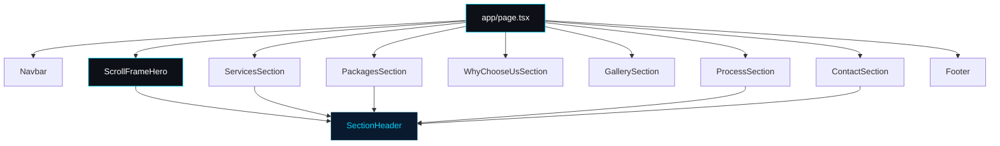
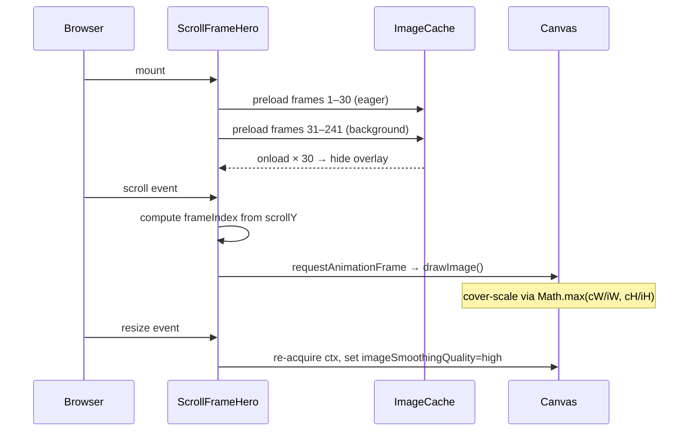
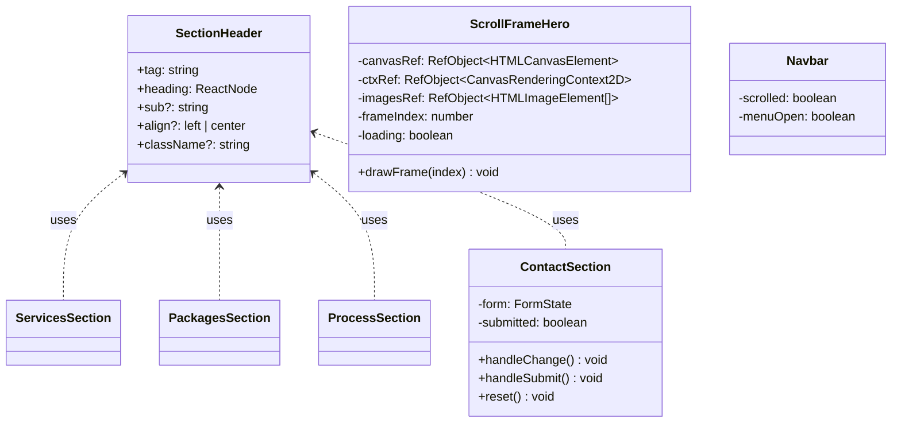

# JILBER Performance Engineering

> Premium car tuning and performance engineering landing page — scroll-driven canvas hero, 8 sections, fully static.

Built with **Next.js 16 · React 19 · TypeScript 5 · Tailwind CSS v4**

---

## Page Architecture



---

## Scroll Hero Pipeline



---

## Tech Stack

| Layer | Technology | Version |
| --- | --- | --- |
| Framework | Next.js (App Router, Turbopack) | 16.2.6 |
| UI Runtime | React | 19.2.4 |
| Language | TypeScript | 5 |
| Styling | Tailwind CSS v4 | 4.x |
| Icons | lucide-react | latest |
| Rendering | Static Site Generation (SSG) | — |
| Bundler | Turbopack | built-in |

---

## Features

- **Scroll-driven canvas hero** — 241-frame JPEG sequence plays as you scroll, cover-scaled to any viewport via `Math.max(cW/iW, cH/iH)`
- **Cached rendering context** — `CanvasRenderingContext2D` stored in a ref; never re-acquired per frame
- **RAF throttle** — pending-flag pattern prevents queuing multiple `requestAnimationFrame` calls on fast scrolls
- **Progressive preload** — first 30 frames load eagerly to hide the overlay; remaining 211 load in the background
- **8 page sections** — Hero, Services, Packages, Why JILBER, Build Showcase, Process, Contact, Footer
- **Reusable `SectionHeader`** — single component handles left-aligned and center-aligned section headings
- **Mobile-first** — `flex-col sm:flex-row` CTAs, fluid typography, hamburger nav
- **Contact form** — service selector, validation, and animated success state
- **Zero JS on server** — fully static output, `'use client'` only where state or effects are needed

---

## Rendering Model

```mermaid
flowchart LR
    subgraph Server["Server (SSG — build time)"]
        L[app/layout.tsx]
        P[app/page.tsx]
        SC[ServicesSection]
        PC[PackagesSection]
        WC[WhyChooseUsSection]
        GC[GallerySection]
        PR[ProcessSection]
        FT[Footer]
        SH[SectionHeader]
    end

    subgraph Client["Client (hydrated — browser)"]
        NB[Navbar\n'use client']
        HE[ScrollFrameHero\n'use client']
        CO[ContactSection\n'use client']
    end

    Server -->|static HTML| Client

    style Server fill:#0d1117,stroke:#374151,color:#9ca3af
    style Client fill:#0a1a2e,stroke:#00d4ff40,color:#00d4ff
```



---

## Component Hierarchy



---

## Page Scroll Layout

```text
┌─────────────────────────────────┐  ← 100vh sticky
│                                 │
│      SCROLL FRAME HERO          │  720vh scroll height
│      (canvas, 241 frames)       │
│                                 │
└─────────────────────────────────┘
┌─────────────────────────────────┐
│         SERVICES                │  bg-black
└─────────────────────────────────┘
┌─────────────────────────────────┐
│         PACKAGES                │  bg-zinc-950
└─────────────────────────────────┘
┌─────────────────────────────────┐
│       WHY CHOOSE US             │  bg-zinc-950
│       (stats bar + grid)        │
└─────────────────────────────────┘
┌─────────────────────────────────┐
│       BUILD SHOWCASE            │  bg-black
│       (6-card grid)             │
└─────────────────────────────────┘
┌─────────────────────────────────┐
│         PROCESS                 │  bg-zinc-950
│       (6-step grid + CTA)       │
└─────────────────────────────────┘
┌─────────────────────────────────┐
│         CONTACT                 │  bg-black
│       (info panel + form)       │
└─────────────────────────────────┘
┌─────────────────────────────────┐
│          FOOTER                 │  bg-black
└─────────────────────────────────┘
```

---

## Getting Started

```bash
npm install
npm run dev
```

Open [http://localhost:3000](http://localhost:3000).

### Scroll Frames

Drop 241 JPEG frames into `public/scroll-frames/`:

```text
public/scroll-frames/frame_0001.jpg
public/scroll-frames/frame_0002.jpg
...
public/scroll-frames/frame_0241.jpg
```

Recommended resolution: **1280×720**. The canvas cover-scales frames to any viewport size automatically.

---

## Scripts

| Command | Description |
| --- | --- |
| `npm run dev` | Development server with Turbopack HMR |
| `npm run build` | Production build (outputs static HTML) |
| `npm run start` | Serve the production build locally |
| `npm run lint` | ESLint check |

---

## Project Structure

```text
app/
  layout.tsx              root layout + metadata
  page.tsx                page composition (section order)
  globals.css             base styles, scrollbar, keyframes
components/
  ScrollFrameHero.tsx     canvas scroll animation + hero copy
  Navbar.tsx              fixed nav with mobile hamburger
  ServicesSection.tsx     service cards grid
  PackagesSection.tsx     Stage 1 / 2 / 3 pricing cards
  WhyChooseUsSection.tsx  stats bar + reasons grid
  GallerySection.tsx      build showcase grid (6 builds)
  ProcessSection.tsx      6-step process + inline CTA
  ContactSection.tsx      contact info panel + booking form
  Footer.tsx              links, socials, certifications
  SectionHeader.tsx       reusable section heading component
public/
  scroll-frames/          frame_0001.jpg … frame_0241.jpg
```

---

Powered By Zaytoun Solutions
