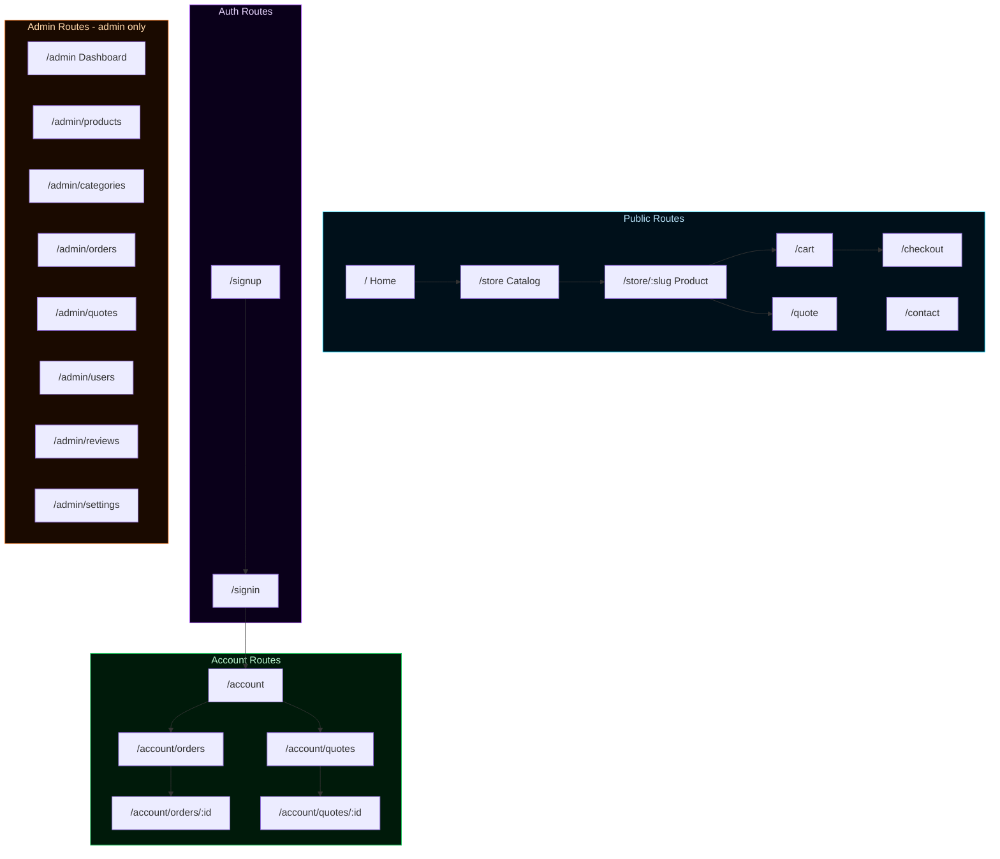
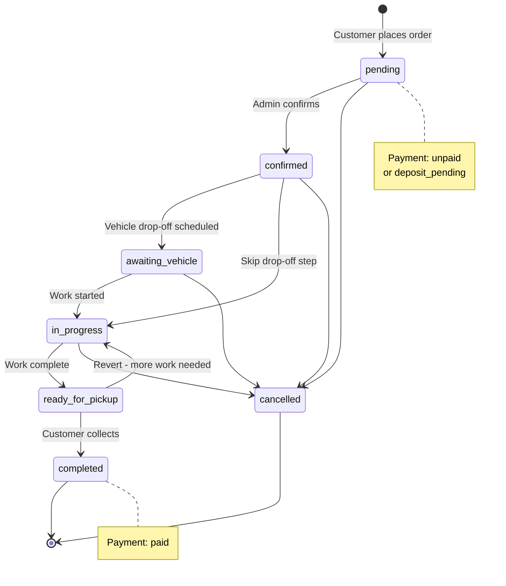
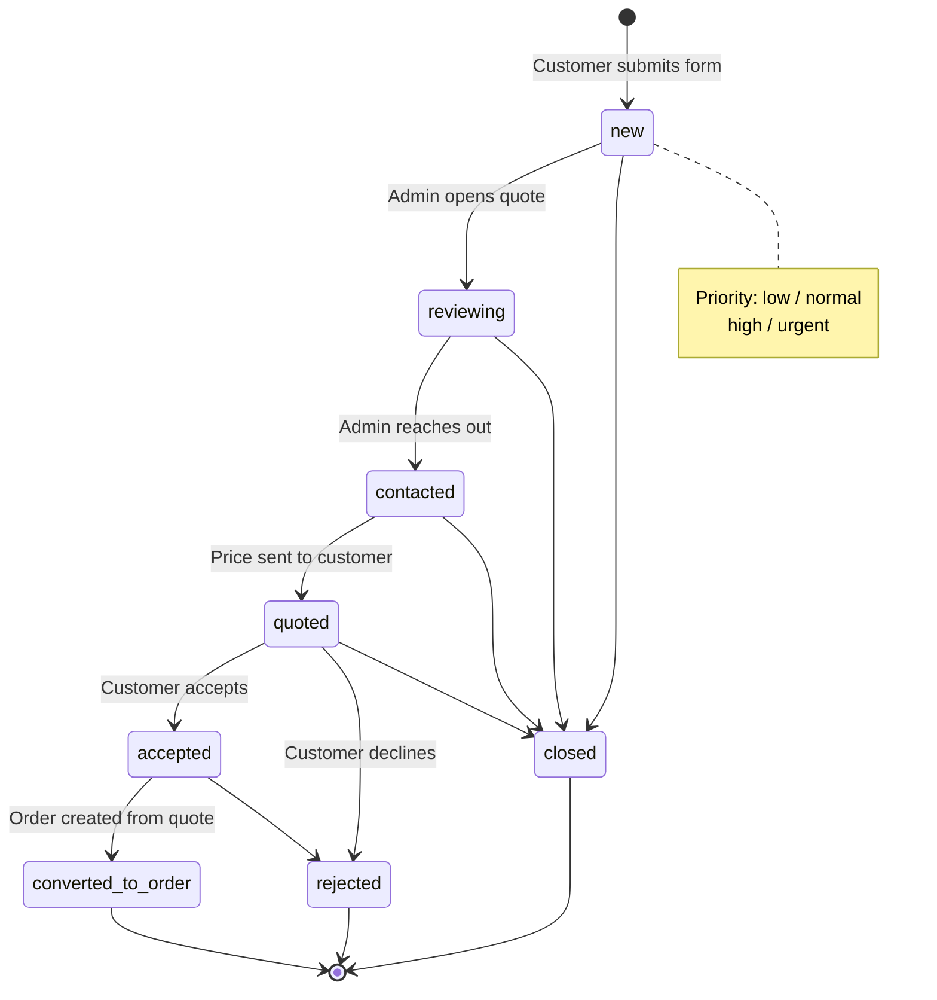
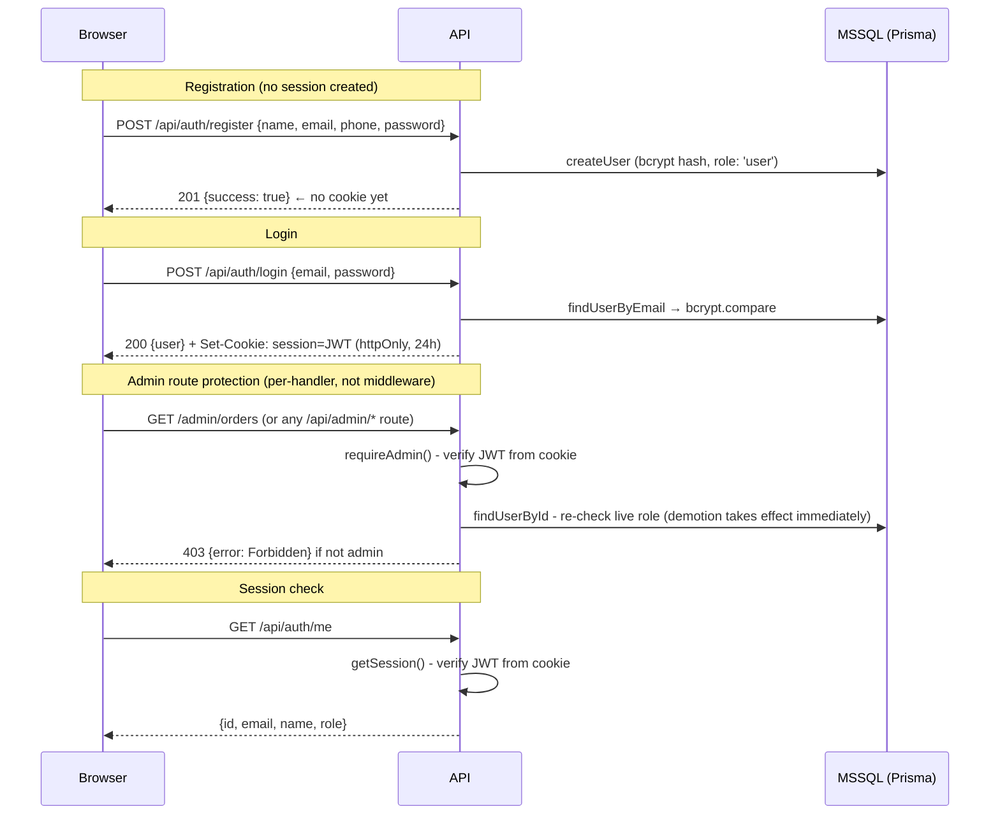
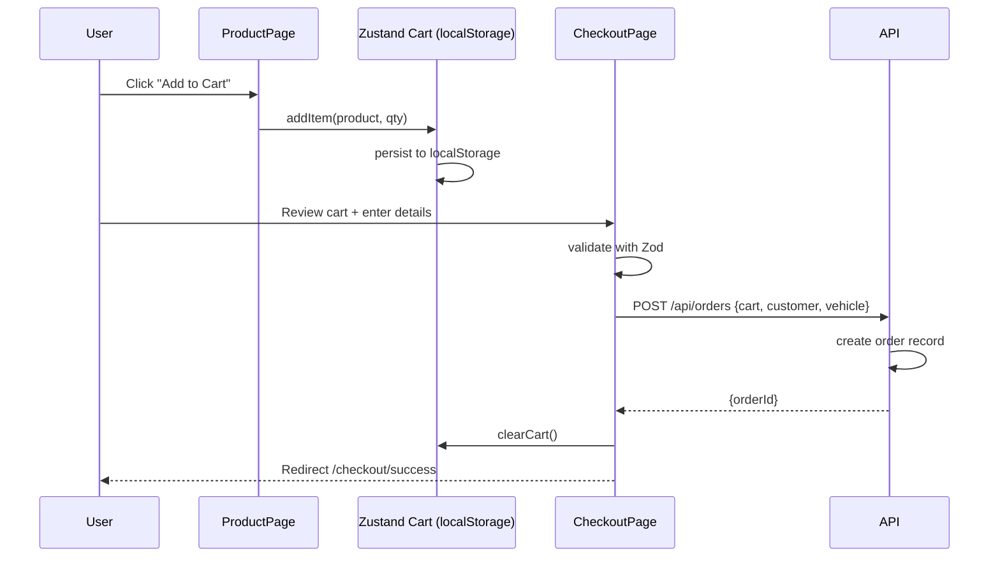
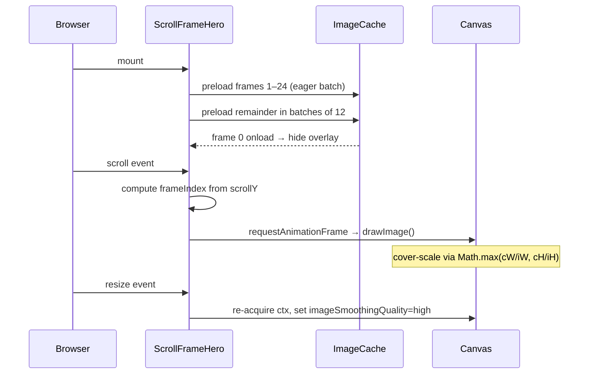

# JILBER Performance Engineering

> Full-stack automotive performance tuning e-commerce platform — product catalog, shopping cart, quote system, order lifecycle, admin dashboard, and WhatsApp integration.

Built with **Next.js 16 · React 19 · TypeScript 5 · Tailwind CSS v4**

---

## Tech Stack

| Layer | Technology | Version |
| --- | --- | --- |
| Framework | Next.js 16 (App Router, Turbopack) | 16.2.6 |
| UI Runtime | React | 19.2.4 |
| Language | TypeScript | 5 |
| Styling | Tailwind CSS v4 | 4.x |
| Auth | JWT via `jose` + `bcryptjs` | — |
| State | Zustand (cart, persisted) | 5.0.13 |
| Validation | Zod | 4.4.3 |
| Icons | lucide-react | latest |
| Database | Microsoft SQL Server | 2022 |
| ORM | Prisma | 6.x |

---

## Application Architecture


```mermaid
graph TD
    subgraph Public["Public Routes"]
        HOME["/ Home"]
        STORE["/store Catalog"]
        SLUG["/store/:slug Product"]
        CART["/cart"]
        CHECKOUT["/checkout"]
        QUOTE["/quote"]
        CONTACT["/contact"]
    end

    subgraph Auth["Auth Routes"]
        SIGNIN["/signin"]
        SIGNUP["/signup"]
    end

    subgraph Account["Account Routes"]
        ACC["/account"]
        ORD["/account/orders"]
        ORDID["/account/orders/:id"]
        QUO["/account/quotes"]
        QUOID["/account/quotes/:id"]
    end

    subgraph Admin["Admin Routes - admin only"]
        ADASH["/admin Dashboard"]
        APROD["/admin/products"]
        ACAT["/admin/categories"]
        AORD["/admin/orders"]
        AQUO["/admin/quotes"]
        AUSR["/admin/users"]
        AREV["/admin/reviews"]
        ASET["/admin/settings"]
    end

    HOME --> STORE
    STORE --> SLUG
    SLUG --> CART
    CART --> CHECKOUT
    SLUG --> QUOTE
    SIGNIN --> ACC
    SIGNUP --> SIGNIN
    ACC --> ORD & QUO
    ORD --> ORDID
    QUO --> QUOID

    style Admin fill:#1a0a00,stroke:#f97316,color:#fed7aa
    style Auth fill:#0a001a,stroke:#a855f7,color:#e9d5ff
    style Account fill:#001a0a,stroke:#22c55e,color:#bbf7d0
    style Public fill:#00101a,stroke:#00d4ff,color:#bae6fd
```

---

## Features

### Storefront

- Scroll-driven canvas hero — 241-frame JPEG sequence cover-scaled to any viewport
- Product catalog with category filtering and search
- Product detail pages with specs, compatibility, ratings, and reviews
- Shopping cart with Zustand (persisted to localStorage) and tax calculation
- Checkout flow with customer info, vehicle details, and payment method selection
- Order confirmation and success page

### Quote System

- Quote request form with product pre-fill (11 service categories)
- Quote status lifecycle: `new → reviewing → contacted → quoted → accepted → converted / rejected`
- Priority levels: low, normal, high, urgent
- Users can track quote progress from their account

### Order Lifecycle

- Full status pipeline: `pending → confirmed → awaiting vehicle → in progress → ready for pickup → completed / cancelled`
- Payment status tracking: unpaid, deposit pending/paid, paid, refunded, not required
- Status history audit trail per order

### Admin Dashboard

- Statistics: products, users, orders, revenue
- Product CRUD with drag-and-drop image upload
- Category management
- Order management with status updates and internal notes
- Quote request management with priority and status updates
- User management and role assignment (user / admin)
- Product review moderation (approve / reject)
- Shop settings: contact info, WhatsApp number, working hours, tax rate, currency

### Contact & Communication

- Floating WhatsApp and phone call buttons (site-wide)
- WhatsApp URL builder with pre-filled messages
- Dedicated contact page
- Product-level and cart-level contact CTAs

### SEO

- JSON-LD structured data (Organization, LocalBusiness)
- Dynamic XML sitemap generation
- Open Graph and Twitter card metadata
- Canonical URLs and robots.txt
- Centralized config at `lib/seo/site-config.ts`

### Auth

- Email + password registration and login
- JWT sessions stored in HTTP-only cookies (24-hour expiry)
- Role-based access control (user / admin)
- Admin-only middleware protection on all `/admin` routes

---

## Order Status Diagram


```mermaid
stateDiagram-v2
    [*] --> pending : Customer places order

    pending --> confirmed : Admin confirms
    pending --> cancelled

    confirmed --> awaiting_vehicle : Vehicle drop-off scheduled
    confirmed --> in_progress : Skip drop-off step
    confirmed --> cancelled

    awaiting_vehicle --> in_progress : Work started
    awaiting_vehicle --> cancelled

    in_progress --> ready_for_pickup : Work complete
    in_progress --> cancelled

    ready_for_pickup --> completed : Customer collects
    ready_for_pickup --> in_progress : Revert - more work needed

    completed --> [*]
    cancelled --> [*]

    note right of pending
        Payment: unpaid
        or deposit_pending
    end note
    note right of completed
        Payment: paid
    end note
```

---

## Quote Lifecycle

> No hard transition enforcement — admin can set any status freely.
> The flow below shows the typical progression.


```mermaid
stateDiagram-v2
    [*] --> new : Customer submits form

    new --> reviewing : Admin opens quote
    new --> closed

    reviewing --> contacted : Admin reaches out
    reviewing --> closed

    contacted --> quoted : Price sent to customer
    contacted --> closed

    quoted --> accepted : Customer accepts
    quoted --> rejected : Customer declines
    quoted --> closed

    accepted --> converted_to_order : Order created from quote
    accepted --> rejected

    converted_to_order --> [*]
    rejected --> [*]
    closed --> [*]

    note right of new
        Priority: low / normal
        high / urgent
    end note
```

---

## Auth Flow


```mermaid
sequenceDiagram
    participant Browser
    participant API
    participant DB as MSSQL (Prisma)

    Note over Browser,API: Registration (no session created)
    Browser->>API: POST /api/auth/register {name, email, phone, password}
    API->>DB: createUser (bcrypt hash, role: 'user')
    API-->>Browser: 201 {success: true}  ← no cookie yet

    Note over Browser,API: Login
    Browser->>API: POST /api/auth/login {email, password}
    API->>DB: findUserByEmail → bcrypt.compare
    API-->>Browser: 200 {user} + Set-Cookie: session=JWT (httpOnly, 24h)

    Note over Browser,API: Admin route protection (per-handler, not middleware)
    Browser->>API: GET /admin/orders  (or any /api/admin/* route)
    API->>API: requireAdmin() - verify JWT from cookie
    API->>DB: findUserById - re-check live role (demotion takes effect immediately)
    API-->>Browser: 403 {error: Forbidden} if not admin

    Note over Browser,API: Session check
    Browser->>API: GET /api/auth/me
    API->>API: getSession() - verify JWT from cookie
    API-->>Browser: {id, email, name, role}
```

---

## Shopping Cart Flow


```mermaid
sequenceDiagram
    participant User
    participant ProductPage
    participant CartStore as Zustand Cart (localStorage)
    participant CheckoutPage
    participant API

    User->>ProductPage: Click "Add to Cart"
    ProductPage->>CartStore: addItem(product, qty)
    CartStore->>CartStore: persist to localStorage

    User->>CheckoutPage: Review cart + enter details
    CheckoutPage->>CheckoutPage: validate with Zod
    CheckoutPage->>API: POST /api/orders {cart, customer, vehicle}
    API->>API: create order record
    API-->>CheckoutPage: {orderId}
    CheckoutPage->>CartStore: clearCart()
    CheckoutPage-->>User: Redirect /checkout/success
```

---

## Scroll Hero Pipeline


```mermaid
sequenceDiagram
    participant Browser
    participant ScrollFrameHero
    participant ImageCache
    participant Canvas

    Browser->>ScrollFrameHero: mount
    ScrollFrameHero->>ImageCache: preload frames 1–24 (eager batch)
    ScrollFrameHero->>ImageCache: preload remainder in batches of 12
    ImageCache-->>ScrollFrameHero: frame 0 onload → hide overlay
    Browser->>ScrollFrameHero: scroll event
    ScrollFrameHero->>ScrollFrameHero: compute frameIndex from scrollY
    ScrollFrameHero->>Canvas: requestAnimationFrame → drawImage()
    Note over Canvas: cover-scale via Math.max(cW/iW, cH/iH)
    Browser->>ScrollFrameHero: resize event
    ScrollFrameHero->>Canvas: re-acquire ctx, set imageSmoothingQuality=high
```

---

## Rendering Model


```mermaid
flowchart LR
    subgraph Server["Server Components (SSR / SSG)"]
        LAY[layout.tsx]
        HOME_S[Home sections]
        STORE_S[Store catalog]
        ADMIN_S[Admin pages]
        SEO[Metadata + JSON-LD]
    end

    subgraph Client["Client Components ('use client')"]
        NAV[Navbar]
        HERO[ScrollFrameHero]
        CART_C["Cart store - Zustand"]
        AUTH_C[AuthProvider]
        FORMS[Checkout / Quote / Review forms]
        FLOAT[FloatingContactButtons]
    end

    Server -->|static HTML| Client

    style Server fill:#0d1117,stroke:#374151,color:#9ca3af
    style Client fill:#0a1a2e,stroke:#00d4ff40,color:#00d4ff
```

---

## Project Structure

```text
app/
  page.tsx                      home page (hero + sections)
  layout.tsx                    root layout + providers
  sitemap.ts                    dynamic XML sitemap
  robots.ts                     robots.txt
  (shop)/
    store/                      product catalog + [slug] detail
    cart/                       shopping cart
    checkout/                   checkout + success
    quote/                      quote request + success
    contact/                    contact page
    account/                    dashboard, profile, orders, quotes
    privacy-policy/
    terms-of-service/
    cookie-policy/
  (auth)/
    signin/                     login
    signup/                     registration
  (admin)/
    admin/                      dashboard
    admin/products/             product CRUD + image upload
    admin/categories/           category management
    admin/orders/               order management
    admin/quotes/               quote management
    admin/users/                user management
    admin/reviews/              review moderation
    admin/settings/             shop settings
  api/
    auth/                       register, login, logout, me
    orders/                     create order, user order history
    account/orders|quotes       user-facing order/quote APIs
    admin/products|categories|orders|quotes|users|reviews|stats|settings
    quotes/                     submit quote request
    reviews/                    submit / list reviews
    contact-info/               public shop contact info

components/
  (auth|store|admin|checkout|quotes|contact|home sections)

lib/
  auth.ts                       JWT + cookie helpers
  session.ts                    server-side session retrieval
  admin.ts                      admin authorization check
  cart.ts                       Zustand cart store
  contact.ts                    WhatsApp/phone URL builders
  seo/                          site-config.ts + helpers.ts
  currency.ts                   STORE_CURRENCY + shared money/total maths
  logger.ts                     structured JSON logging
  observability.ts              error-reporter seam (optional webhook)
  login-throttle.ts             per-account login lockout
  rate-limit.ts                 in-memory IP rate limiter
  db/prisma.ts                  PrismaClient singleton
  users.ts                      user repository (Prisma/MSSQL)
  products.ts                   product repository
  orders.ts                     order repository
  categories.ts                 category repository
  quotes.ts                     quote repository
  reviews.ts                    review repository
  settings.ts                   settings repository
  payments/whish.ts             Whish client + pure predicates
  payments/whish-settle.ts      authoritative payment settlement
  payments/whish-boot.ts        sandbox-vs-production boot assertion

types/
  admin.ts                      Order, Quote, User, Settings types
  quotes.ts                     QuoteRequest, QuoteStatus types

data/
  products.ts                   static seed data + Product type

public/
  scroll-frames/                frame_0001.jpg … frame_0241.jpg
```

---

## Getting Started

### 1. Clone and install dependencies

```bash
git clone <repository-url>
cd jilber_car_tune_store
npm ci
```

Use `npm ci` on a fresh clone so npm installs exactly the versions recorded in
`package-lock.json`. Use `npm install` only when intentionally adding or updating
dependencies.

### 2. Configure environment

Copy `.env.example` to `.env` (Prisma reads `.env`) and fill in the values:

```bash
cp .env.example .env
```

PowerShell equivalent:

```powershell
Copy-Item .env.example .env
```

Required variables:

```env
# MSSQL connection (Prisma sqlserver connector)
DATABASE_URL="sqlserver://localhost:1433;database=jilber;user=sa;password=Your_strong_Pass123;encrypt=true;trustServerCertificate=true"

# 32+ character secret for JWT signing
AUTH_SECRET=your-secret-here

# Production domain (no trailing slash) — used for sitemap, OG tags, canonicals
NEXT_PUBLIC_SITE_URL=https://example.com
```

Generate a secure `AUTH_SECRET`:

```bash
node -e "console.log(require('crypto').randomBytes(32).toString('hex'))"
```

For local development, set `NEXT_PUBLIC_SITE_URL=http://localhost:3000`. The
`.env` file contains secrets and is intentionally ignored by Git, so it must be
created separately on every machine.

The three variables above are the only **required** ones. `.env.example`
documents the full set — email (Resend), Whish card payments, upload paths,
`TRUSTED_PROXY_COUNT`, admin bootstrap, and backup credentials. Read it before
deploying; several have security consequences if left at their defaults.

> **`NODE_ENV=production` is load-bearing.** `whish-pay` selects its API host
> from it alone, so a production deploy without it silently runs against the
> Whish **sandbox** — checkout appears to succeed and no money is collected. The
> app now refuses to boot in that state. See [`docs/deployment.md`](docs/deployment.md).

### 3. Start SQL Server, migrate, and seed

Start a local SQL Server (Docker):

```bash
docker run -e "ACCEPT_EULA=Y" -e "MSSQL_SA_PASSWORD=Your_strong_Pass123" \
  -p 1433:1433 -d --name jilber-mssql mcr.microsoft.com/mssql/server:2022-latest
```

Apply the migrations committed to the repository, then seed the catalog and any
legacy `.dev-*.json` data that is present:

```bash
npx prisma migrate deploy
npm run db:seed
```

> **`npm run db:seed` is development-only.** It overwrites every product field,
> resets settings, and deletes orders. It refuses to run when `NODE_ENV=production`
> or when `DATABASE_URL` points at a non-local host. On a real deployment create
> the first admin with `npm run db:seed:admin` instead — that is the only
> supported path, and it is env-driven:
>
> ```bash
> ADMIN_BOOTSTRAP_EMAIL=you@example.com > ADMIN_BOOTSTRAP_PASSWORD='a-strong-password' > npm run db:seed:admin
> ```

Use `npm run db:migrate` (`prisma migrate dev`) only while developing a schema
change and creating a new migration. Do not create an extra migration during a
normal fresh-machine setup.

### 4. Start development server

```bash
npm run dev
```

Open [http://localhost:3000](http://localhost:3000).

To verify and run the production build locally instead:

```bash
npm run build
npm run start
```

### 5. Create an admin account

On a fresh database no admin exists, so use the env-driven bootstrap — this is
the only path that works before anyone has signed up:

```bash
ADMIN_BOOTSTRAP_EMAIL=you@example.com ADMIN_BOOTSTRAP_PASSWORD='a-strong-password' npm run db:seed:admin
```

To promote a user who has **already registered** at `/signup`:

```bash
node scripts/make-admin.mjs user@example.com
```

### 6. Scroll frames (optional)

Drop 241 JPEG frames into `public/scroll-frames/`:

```text
public/scroll-frames/frame_0001.jpg
public/scroll-frames/frame_0002.jpg
...
public/scroll-frames/frame_0241.jpg
```

Recommended resolution: **1280×720**.

---

## Scripts

| Command | Description |
| --- | --- |
| `npm run dev` | Development server with Turbopack HMR |
| `npm run build` | Production build |
| `npm run start` | Serve the production build locally |
| `npm run lint` | ESLint check |
| `npm run db:migrate` | Create/apply Prisma migrations (`prisma migrate dev`) |
| `npm run test` | Run the Vitest suite once |
| `npm run test:watch` | Vitest in watch mode |
| `npm run db:seed` | **Dev only.** Seed catalog + import legacy JSON. Refuses to run against production |
| `npm run db:seed:admin` | Create/promote the first admin from `ADMIN_BOOTSTRAP_*` |
| `npm run db:studio` | Open Prisma Studio to browse the database |
| `npm run reconcile:payments` | Recover card orders whose Whish callback never arrived |

### Deployment

Production runs on a self-managed VPS. The runbook and the committed artifacts
(`deploy/ecosystem.config.js`, `deploy/nginx.conf`, `deploy/deploy.sh`,
`deploy/backup.sh`, `deploy/restore-drill.sh`, `deploy/crontab.example`) are
documented in **[`docs/deployment.md`](docs/deployment.md)**. Outstanding
production-readiness work is tracked in
**[`docs/TASKS_3.md`](docs/TASKS_3.md)**.

### Files that must remain committed

- `package-lock.json` makes `npm ci` reproducible across machines and CI.
- `prisma/migrations/migration_lock.toml` records the Prisma migration provider.
- `prisma/migrations/` contains the database history applied by
  `prisma migrate deploy`.

Do not add these files to `.gitignore`. Local secrets (`.env`), dependencies
(`node_modules/`), and generated Next.js output (`.next/`) remain ignored.

---

## Data Storage

The project persists all data in **Microsoft SQL Server** via **Prisma**. The schema lives in [`prisma/schema.prisma`](prisma/schema.prisma); the data-access layer is a set of repository modules under `lib/*.ts` that expose stable, async function signatures (`getProducts`, `createOrder`, `findUserByEmail`, …) so API routes and server components never touch SQL directly.

| Table | Contents |
| --- | --- |
| `users` | User accounts (bcrypt-hashed passwords) |
| `products` | Product catalog (array fields stored as JSON columns) |
| `categories` | Product categories |
| `orders` / `order_items` / `order_status_history` | Orders, line items, and status history |
| `quotes` | Quote requests |
| `reviews` | Product reviews (unique per user+product) |
| `settings` | Admin shop settings (singleton row) |

**SQL Server connector notes:** the Prisma `sqlserver` connector has no native `enum` or `Json` scalar, so status/role/priority fields are stored as `String` (validated by the TypeScript union types + Zod schemas) and array/object value-fields are stored as `NVARCHAR(MAX)` JSON columns, mapped to/from arrays in the repository layer.

**Migrating from the old JSON stores:** [`prisma/seed.ts`](prisma/seed.ts) reads any legacy `.dev-*.json` files still present in the project root and imports them (falling back to `data/products.ts` for the catalog). Run it with `npm run db:seed`. The connection target is fully env-driven (`DATABASE_URL`), so moving from local SQL Server to Azure SQL later requires no code changes.

---

Powered by Zaytoun Solutions
